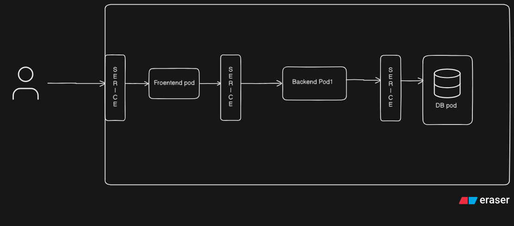
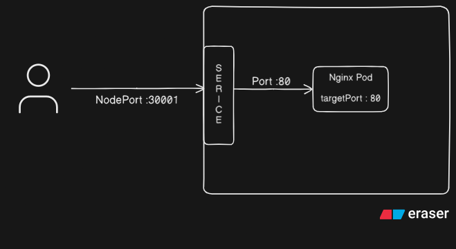
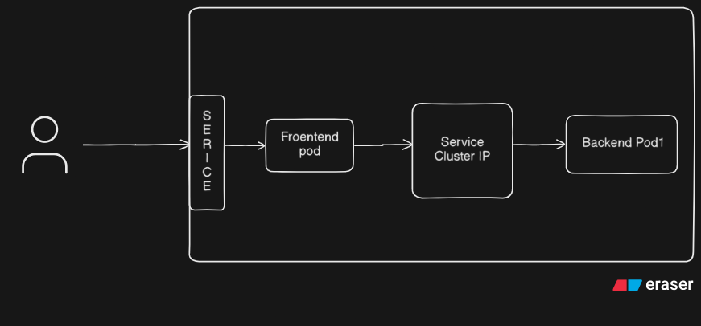
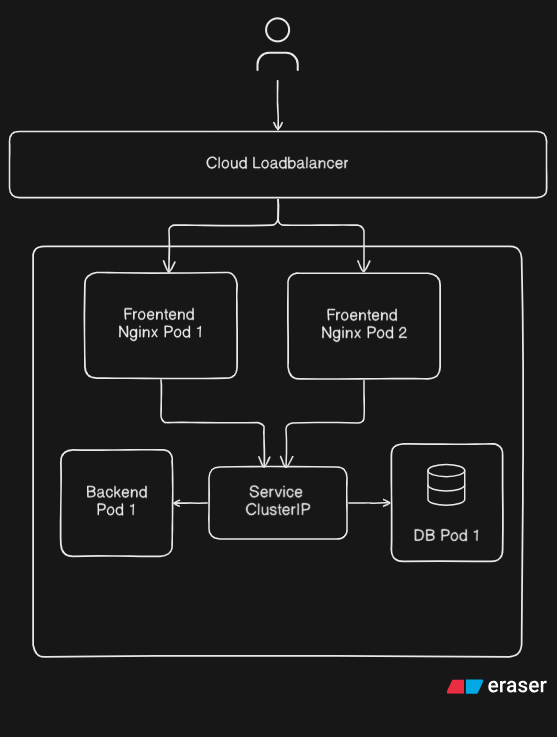

# Kubernetes Services

A **Service** in Kubernetes is an abstraction that provides a stable network endpoint to access a group of Pods. Services give a consistent way to reach your application — regardless of which pods are running or where.

---

## Table of Contents

- [What is a Service?](#what-is-a-service)
- [Types of Services](#types-of-services)
- [kubectl Service Commands](#kubectl-service-commands)
- [1. NodePort Service](#1-nodeport-service)
- [2. ClusterIP Service](#2-clusterip-service)
- [3. LoadBalancer Service](#3-loadbalancer-service)
- [4. ExternalName Service](#4-externalname-service)
- [Other Useful Commands](#other-useful-commands)
- [References](#references)

---

## What is a Service?

Without a Service, you'd need to track individual pod IPs — which change every time a pod restarts. A Service:

- Gives pods a **stable IP and DNS name**
- **Load balances** traffic across all matching pods
- Uses **label selectors** to find which pods to route traffic to
- Abstracts the underlying pods from the consumers



---

## Types of Services

| Type | Access Scope | Use Case |
|---|---|---|
| **ClusterIP** | Internal only (default) | Pod-to-pod communication inside the cluster |
| **NodePort** | External via node IP + port | Dev/testing, direct access from outside |
| **LoadBalancer** | External via cloud load balancer | Production traffic from the internet |
| **ExternalName** | DNS alias to external service | Redirect traffic to services outside the cluster |

---

## kubectl Service Commands

```bash
# Explain the service resource fields
kubectl explain service

# List all services
kubectl get service

# Describe a specific service
kubectl describe service/<service-name>
```

---

## 1. NodePort Service

A **NodePort** service exposes your application on a **static port on every node** in the cluster. Anyone who can reach the node's IP can access the application via that port.



### Port Breakdown

```
External User
      │
      ▼
[ NodePort ]  ← Port exposed on the Node (range: 30000–32767)
      │
      ▼
[   Port   ]  ← Internal Service port (other apps use this to communicate)
      │         e.g. frontend talks to backend via this port
      ▼
[ targetPort ] ← Port the actual container/app listens on
```

| Port Type | Description |
|---|---|
| **NodePort** | External-facing port on the Node. Range: `30000–32767`. This is what users hit from outside |
| **Port** | The Service's internal port. Used for internal app-to-app communication (e.g. frontend → backend) |
| **targetPort** | The port the container is actually listening on inside the pod |

---

### 1a. Create and Apply the Deployment

```bash
kubectl apply -f nginx-deploy.yaml
```

> **Note:** The Service does not define images — it connects to pods that are already running by matching their **labels**.


### 1b. Create the NodePort Service

```bash
vim node-port.yaml
```

```yaml
apiVersion: v1
kind: Service
metadata:
  name: nodeport-svc
  labels:
    env: demo
spec:
  type: NodePort
  selector:
    env: demo          # matches pods with this label from the deployment
  ports:
    - port: 80         # internal service port
      targetPort: 80   # port the container listens on
      nodePort: 30001  # external port on the node (30000–32767)
```

Apply and verify:

```bash
kubectl apply -f node-port.yaml

# List all services
kubectl get svc

# Describe the service in detail
kubectl describe svc/nodeport-svc
```


### 1c. Access the Application

Open your browser or run:

```bash
curl localhost:30001
```

> **KIND Cluster Note:** If you are using a KIND cluster, you must add **port mapping** in your `kind-config.yaml` before creating the cluster, otherwise the NodePort won't be accessible from your machine:


### 1d. List All Objects in the `env: demo` Environment

```bash
kubectl get all -l env=demo
```

This lists all pods, services, deployments, and replicasets that have the label `env=demo`.

---

## 2. ClusterIP Service

**ClusterIP** is the **default** service type in Kubernetes. It exposes the service on an internal IP address that is only reachable from within the cluster.



### Why ClusterIP?

Every pod gets a unique IP address — but that IP changes whenever the pod restarts. ClusterIP provides a **stable internal IP and DNS name** so other services can reliably communicate with a group of pods regardless of pod restarts.


### What is an Endpoint?

An **Endpoint** is the actual IP address of a pod that the service routes traffic to.

- When a pod starts, its IP is registered as an Endpoint for matching services
- When a pod restarts and gets a new IP, the Endpoint is **automatically updated**

```bash
# View endpoints for all services
kubectl get endpoints
```


### 2a. Create the ClusterIP Service

```bash
vim cluster-ip.yaml
```

```yaml
apiVersion: v1
kind: Service
metadata:
  name: cluster-svc
  labels:
    env: demo
spec:
  type: ClusterIP      # default type, can also be omitted
  selector:
    env: demo          # matches pods with this label
  ports:
    - port: 80         # internal service port
      targetPort: 80   # container port
```

Apply the service:

```bash
kubectl apply -f cluster-ip.yaml
```


### 2b. View the ClusterIP Service

```bash
# List all services
kubectl get svc

# Describe the service in detail — shows IP, endpoints, and selector
kubectl describe svc/cluster-svc
```

---

## 3. LoadBalancer Service

A **LoadBalancer** service exposes your application externally using a **cloud provider's load balancer** (e.g. AWS ALB, GCP Load Balancer, Azure LB). It distributes incoming traffic across multiple pods/nodes automatically.



### How it Works

```
Internet Traffic
      │
      ▼
[ Cloud Load Balancer ]  ← External IP provisioned by cloud provider
      │
      ├──► Node 1 ──► Pod A
      ├──► Node 2 ──► Pod B
      └──► Node 3 ──► Pod C
```

Every pod gets its own IP, but those IPs change on restart. The LoadBalancer sits in front and routes traffic to healthy pods automatically — you don't have to track individual pod IPs.

---

### 3a. Create and Apply the LoadBalancer Service

```bash
vim loadbalancer.yaml
kubectl apply -f loadbalancer.yaml
kubectl get svc
```


> **KIND Cluster Note:** When using a KIND cluster, the LoadBalancer service will stay in **Pending** state indefinitely:
> This is because KIND runs locally and has no cloud provider to provision an external load balancer. To test LoadBalancer locally, use tools like [MetalLB](https://metallb.universe.tf/) or use NodePort instead.

---

## 4. ExternalName Service

An **ExternalName** service is a special type that acts as a **DNS alias** for a service located **outside the cluster**. It maps a Kubernetes service name to an external DNS name — no proxying or load balancing involved.

### Use Case

When your application inside the cluster needs to reach an external service (like a managed database, third-party API, or service in another namespace), you can create an ExternalName service so your app uses a consistent internal name without hardcoding external URLs.

```yaml
apiVersion: v1
kind: Service
metadata:
  name: external-db-svc
spec:
  type: ExternalName
  externalName: my-database.example.com   # external DNS name to resolve to
```

```
Pod inside cluster
      │
      ▼
  external-db-svc  (ExternalName Service)
      │
      ▼
  my-database.example.com  (outside the cluster)
```

---

## Other Useful Commands

### Expose a Deployment Directly (Imperative)

If a deployment is already running and you want to quickly create a service for it:

```bash
kubectl expose deployment nginx-pod --port=80 --target-port=8000
```

This creates a ClusterIP service by default. Add `--type=NodePort` or `--type=LoadBalancer` to change the type.

---

## Quick Reference

| Action | Command |
|---|---|
| Explain service resource | `kubectl explain service` |
| List all services | `kubectl get svc` |
| Describe a service | `kubectl describe svc/<service-name>` |
| View endpoints | `kubectl get endpoints` |
| Apply a service | `kubectl apply -f <service-file>.yaml` |
| List all objects with label | `kubectl get all -l env=demo` |
| Expose deployment as service | `kubectl expose deployment <name> --port=80 --target-port=8000` |

---

## References

- [Kubernetes Docs — Service](https://kubernetes.io/docs/concepts/services-networking/service/)

