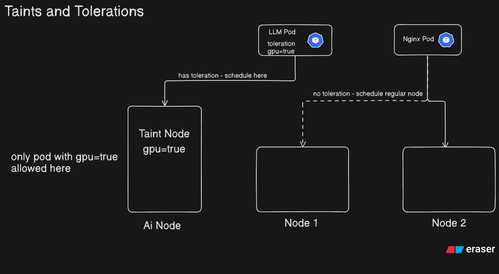

# Taints, Tolerations and Node Selectors

## Table of Contents

- [Concepts](#concepts)
  - [Taints and Tolerations](#taints-and-tolerations)
  - [Taint Effects](#taint-effects)
  - [Node Selector](#node-selector)
  - [Taint/Toleration vs Node Selector](#tainttoleration-vs-node-selector)
- [Files](#files)
- [Task Walkthrough](#task-walkthrough)
  - [Task 1 — Taints and Tolerations](#task-1--taints-and-tolerations)
  - [Task 2 — Node Selector](#task-2--node-selector)
- [Key Behaviours to Remember](#key-behaviours-to-remember)
- [References](#references)

---

## Concepts

### Taints and Tolerations

A mechanism to control which pods are allowed to schedule on which nodes.

- **Taint** — applied to a **node**. Acts as a block — repels pods that don't have a matching toleration.
- **Toleration** — applied to a **pod**. Acts as a permission — allows the pod to be scheduled on a tainted node.



A real-world example: the control plane node is tainted by default (`node-role.kubernetes.io/control-plane:NoSchedule`), which is why normal workload pods don't get scheduled there.

### Taint Effects

| Effect | Behaviour |
|---|---|
| `NoSchedule` | New pods without a matching toleration will not be scheduled on the node. Existing pods are unaffected. |
| `PreferNoSchedule` | Kubernetes tries to avoid scheduling pods without a toleration here, but it is not guaranteed. |
| `NoExecute` | New pods without a toleration won't be scheduled, and existing pods without a toleration are evicted. |

### Node Selector

A simpler alternative for node targeting. Instead of blocking pods, you **label a node** and then tell the pod to only schedule on nodes with that label using `nodeSelector` in the pod spec.

### Taint/Toleration vs Node Selector

| | Taint + Toleration | Node Selector |
|---|---|---|
| Applied to | Node (taint) + Pod (toleration) | Node (label) + Pod (nodeSelector) |
| Mechanism | Repel pods unless they have permission | Attract pods only to matching nodes |
| Use case | Restrict a node to specific workloads | Pin a pod to a specific node or node group |
| Guarantee | Hard block (`NoSchedule`) or eviction (`NoExecute`) | Hard match — pod stays Pending if no node matches |

---


## Task Walkthrough

### Task 1 — Taints and Tolerations

**1a. Taint a node**
```bash
kubectl taint node cka-cluster-worker-1 gpu=true:NoSchedule
```

**1b. Verify the taint**
```bash
kubectl describe node cka-cluster-worker-1
```
Look for the `Taints` field in the output.

**1c. Deploy a pod without tolerations**
```bash
kubectl apply -f nginx-pod.yaml
kubectl get pods
```
Pod stays in `Pending` — no toleration, blocked by the taint.

**1d. Deploy a pod with a matching toleration**
```bash
kubectl apply -f redis-toleration-pod.yaml
kubectl get pods
```
Pod moves to `Running` — toleration matches the taint, scheduling allowed.

**1e. Remove the taint**
```bash
kubectl taint node cka-cluster-worker-1 gpu=true:NoSchedule-
```
The `-` at the end removes the taint.

Verify both pods are now running:
```bash
kubectl get pods -o wide
```

---

### Task 2 — Node Selector

**2a. Apply the pod with nodeSelector**
```bash
kubectl apply -f node_selector_nginxpod.yaml
kubectl get pods
```
Pod stays in `Pending` — no node has the label `gpu=false` yet.

```bash
kubectl describe pod nginx-new-pod
```
Events will show: `0/N nodes are available: N node(s) didn't match Pod's node affinity/selector`.

**2b. Label the node**
```bash
kubectl label node cka-cluster-worker-1 gpu=false
```

**2c. Verify**
```bash
kubectl get nodes --show-labels
kubectl get pods -o wide
```
Pod now schedules on the labelled node.

---


## References

- [Taints and Tolerations — Kubernetes Docs](https://kubernetes.io/docs/concepts/scheduling-eviction/taint-and-toleration/)