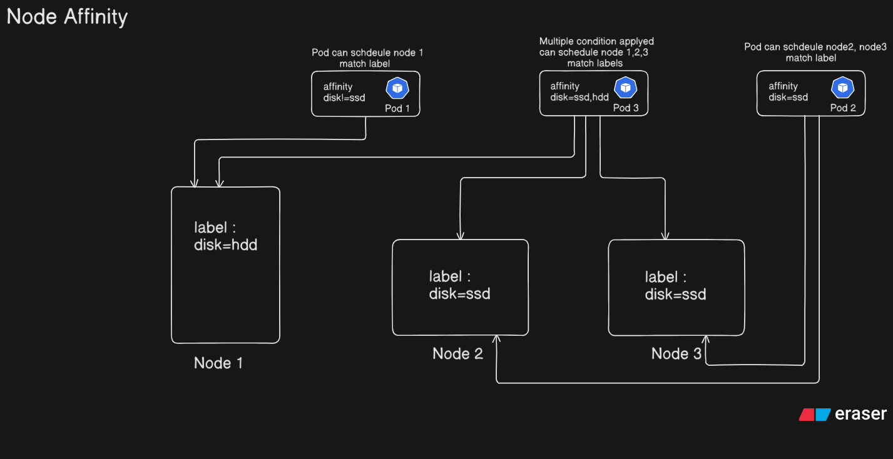

# Node Affinity

## Table of Contents

- [Context](#context)
- [What is Node Affinity](#what-is-node-affinity)
- [Affinity Types](#affinity-types)
- [What Happens if a Label is Removed After Scheduling](#what-happens-if-a-label-is-removed-after-scheduling)
- [Operators](#operators-types)
- [Node Label Commands](#node-label-commands)
- [Files](#files)
- [Task Walkthrough](#task-walkthrough)
  - [Task 1 — requiredDuringSchedulingIgnoredDuringExecution](#task-1--requiredduringschedulingignoredduringexecution)
  - [Task 2 — preferredDuringSchedulingIgnoredDuringExecution](#task-2--preferredduringschedulingignoredduringexecution)
- [References](#references)

---

## Context

Taints and Tolerations control which pods are **repelled** from nodes, but they cannot enforce that a pod runs **only** on a specific node. For that, use Node Affinity.

> See [Limitations of Taints and Tolerations](./taint-toleration-limitations.md) for a full explanation of why Node Affinity is needed.

---

## What is Node Affinity

Node Affinity in Kubernetes controls which nodes a Pod is eligible to run on by evaluating **node labels**. 
It is more flexible than `nodeSelector` because it supports operators, multiple conditions, and scheduling preferences.



---

## Affinity Types

| Type | Scheduling | During Execution |
|---|---|---|
| `requiredDuringSchedulingIgnoredDuringExecution` | Scheduler **must** match the rule — pod stays `Pending` if no node matches | Label changes after pod is running are **ignored** |
| `preferredDuringSchedulingIgnoredDuringExecution` | Scheduler **tries** to match the rule — if no node matches, pod still schedules elsewhere | Label changes after pod is running are **ignored** |

---

## What Happens if a Label is Removed After Scheduling

Both affinity types have `IgnoredDuringExecution` — meaning once a pod is running, the scheduler no longer checks the node labels. If you remove the label (`disktype=ssd`) from a node after the pod is already running there, **the pod continues to run unaffected**. 
The affinity rule only applies at scheduling time.

---

## Operators types

| Operator | Behaviour |
|---|---|
| `In` | Node label value must be in the specified list |
| `NotIn` | Node label value must not be in the specified list |
| `Exists` | Node must have the specified label key (any value) |
| `DoesNotExist` | Node must not have the specified label key |

---

## Node Label Commands

```bash
# Add a label to a node
kubectl label node <node-name> <key>=<value>

# Remove a label from a node
kubectl label node <node-name> <key>-

# List all node labels
kubectl get nodes --show-labels
```

---

## Files

| File | Purpose |
|---|---|
| `redis-affinity1.yaml` | Pod using `required` affinity — must land on a node labelled `disktype=ssd` |
| `nginx-affinity2.yaml` | Pod using `preferred` affinity — prefers `disktype=hdd`, schedules anywhere if not found |

---

## Task Walkthrough

### Task 1 — requiredDuringSchedulingIgnoredDuringExecution

**1a. Create redis-affinity1 yaml file**
```bash
vim redis-affinity1.yaml
```
**1b. Apply the pod**
```bash
kubectl apply -f redis-affinity1.yaml
kubectl get pods
kubectl describe pod redis-pod
```
Pod stays in `Pending` — no node has the label `disktype=ssd`.

**1c. List nodes**
```bash
kubectl get nodes
```

**1d. Add the label to a node**
```bash
kubectl label node cka-cluster-worker-01 disktype=ssd
```

**1e. Verify**
```bash
kubectl get nodes --show-labels
kubectl get pods
```
Pod schedules on `cka-cluster-worker-01` and moves to `Running`.

---

### Task 2 — preferredDuringSchedulingIgnoredDuringExecution
**2a. Create nginx-affinity1 yaml file**
```bash
vim nginx-affinity1.yaml
```

**2b. Apply the pod**
```bash
kubectl apply -f nginx-affinity2.yaml
kubectl get pods
```
No node has the label `disktype=hdd`. Because the rule is `preferred` (not required), the scheduler still places the pod on an available node — pod moves to `Running`.

---


## References

- [Node Affinity — Kubernetes Docs](https://kubernetes.io/docs/concepts/scheduling-eviction/assign-pod-node/#affinity-and-anti-affinity)
-  [Limitations of Taints and Tolerations](./taint-toleration-limitations.md)