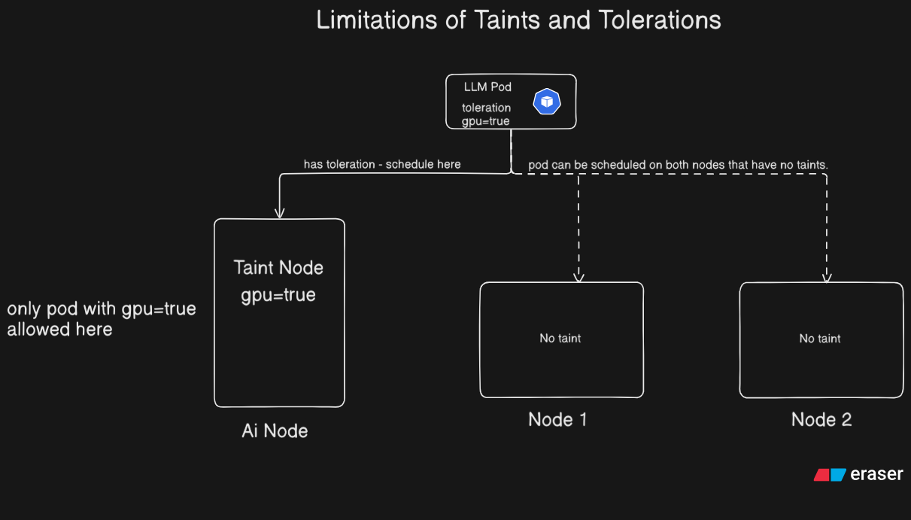

# Limitations of Taints and Tolerations

## Table of Contents

- [Overview](#overview)
- [Limitations](#limitations)
- [What to Use Instead](#what-to-use-instead)

---

## Overview

Taints and Tolerations are useful for repelling pods from nodes, but they have notable limitations when you need more precise scheduling control.

---

## Limitations

**1. Cannot express multiple conditions or complex expressions**

Taints and tolerations work on simple key-value matching. You cannot combine conditions like "schedule only if the node has GPU and is in zone us-east-1".

**2. Tolerations do not enforce pod placement on the tainted node**

This is the most important limitation.

Consider this scenario:
- Node 1 — tainted with `gpu=true:NoSchedule`
- Node 2 — no taint
- Node 3 — no taint
- Pod — has a toleration for `gpu=true:NoSchedule`

The pod **can** schedule on Node 1 (it tolerates the taint), but it can **also** schedule on Node 2 or Node 3 (no taint to block it). The toleration only grants permission — it does not enforce placement.

> **NOTE:** A toleration cannot force a pod to run only on a tainted node. It simply allows the pod to run there if the scheduler decides to place it there.

---

## What to Use Instead

To enforce that a pod runs **only** on a specific node or group of nodes, use **Node Affinity**.

Node Affinity allows you to express rules like:
- "This pod must run on a node labelled `gpu=true`"
- "This pod prefers nodes in zone `us-east-1` but can run elsewhere"

See the [Node Affinity README](./Readme.md) for details.